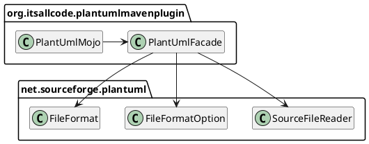

# Design

## Introduction

This document describes the architecture of the PlantUML Maven Plugin. It follows the [arc42](https://docs.arc42.org) template.

## Solution Strategy

The plugin is implemented as a Maven Mojo. It interacts with the PlantUML library to render diagrams. The PlantUML dependency is declared by the user, not by building a fat jar.

A facade abstracts the reflective way of accessing the PlantUML classes.

## Building Block View

The Maven Plugin consists of a MavenMojo and a PlantUML facade.

### Used PlantUML Classes

The [`SourceFileReader`](https://github.com/plantuml/plantuml/blob/master/src/main/java/net/sourceforge/plantuml/SourceFileReader.java) — despite its name — does not only read files, but also decides where the rendered result they should go in the output directory.

[`FileFormat`](https://github.com/plantuml/plantuml/blob/master/src/main/java/net/sourceforge/plantuml/FileFormat.java) is an enum listing file formats PlantUML can handle with file extensions and Mime types. The facade abstracts and restricts this with `ImageFormat`.

[`FileFormatOption`](https://github.com/plantuml/plantuml/blob/master/src/main/java/net/sourceforge/plantuml/FileFormatOption.java) is a parameter object that be used to control a number of settings for the generated output files. 

## Runtime View

### Render Using Configured PlantUML Dependency
`dsn~render-using-configured-plant-uml-dependency~1`

**GIVEN** the PlantUML dependency is configured in the POM file
**WHEN** he `execute()` method is called
**THEN** the plugin uses the configured PlantUML library version to render diagrams.

Covers:

* `scn~render-using-configured-plantuml-version~1`

Needs: impl, utest

### Render to Default Output Directory
`dsn~render-default-output-directory~1`

**GIVEN** the `outputDirectory` Mojo parameter is null or empty
**WHEN** the `execute()` method is called
**THEN** the plugin resolves `${project.build.directory}/generated-diagrams` as the target path
**AND** invokes the PlantUML library to write diagrams to that path.

Covers:
* `scn~render-default-output-directory~1`

Needs: impl

### Configure Output Directory
`dsn~configure-output-directory~1`

**GIVEN** the `outputDirectory` Mojo parameter is set to a specific path
**WHEN** the `execute()` method is called
**THEN** the plugin uses the configured path as the target for diagram generation.

Covers:
* `scn~configure-output-directory~1`

Needs: impl

### Render PNG
`dsn~render-png~1`

**GIVEN** the `formats` Mojo parameter includes `PNG` (case-insensitive)
**WHEN** the `execute()` method is called
**THEN** the plugin configures the PlantUML `FileFormatOption` to `PNG` for each input file.

Covers:
* `scn~render-png~1`

Needs: impl

### Render SVG
`dsn~render-svg~1`

**GIVEN** the `formats` Mojo parameter includes `SVG` (case-insensitive)
**WHEN** the `execute()` method is called
**THEN** the plugin configures the PlantUML `FileFormatOption` to `SVG` for each input file.

Covers:
* `scn~render-svg~1`

Needs: impl

## Architecture Decisions

### How Does the Plugin use the PlantUML Library?

We did not want to bundle the PlantUML library with the jar, to allow users to update independently.

#### Dynamic PlantUML Dependency
`dsn~dynamic-dependency~1`

To allow the user to select the PlantUML version, the plugin does not include PlantUML as a compile-time dependency. Instead, it loads the specified version of PlantUML at runtime using Maven's dependency resolution mechanism.

Rationale:

This avoids a fat jar and allows the plugin to be independent of specific PlantUML versions, giving users full control. Additionally, this allows using forks instead of the original PlantUML dependency (if that should ever be necessary).

Covers:
* `scn~render-using-configured-plantuml-version~1`

Needs: impl

#### Alternatives Considered

We also thought about having the plugin load the PlantUML library at runtime. The UX benefit would be that the users only need to provide the version number and the configuration would be more compact.

We decided against this option because it would make the code more complicated and cost flexibility in picking the dependency. Also, it would be code duplication with Maven's dependency resolution mechanism.

## Quality

See ["Quality Requirements"](design/quality_requirements.md)